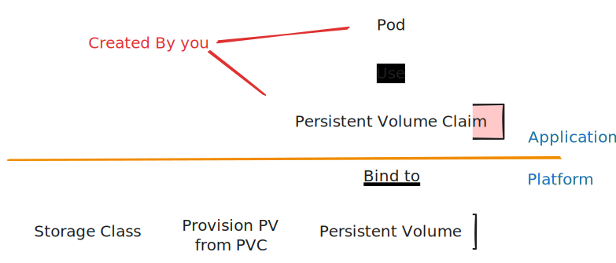
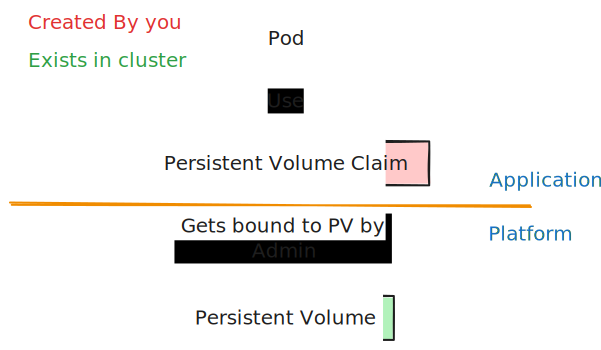
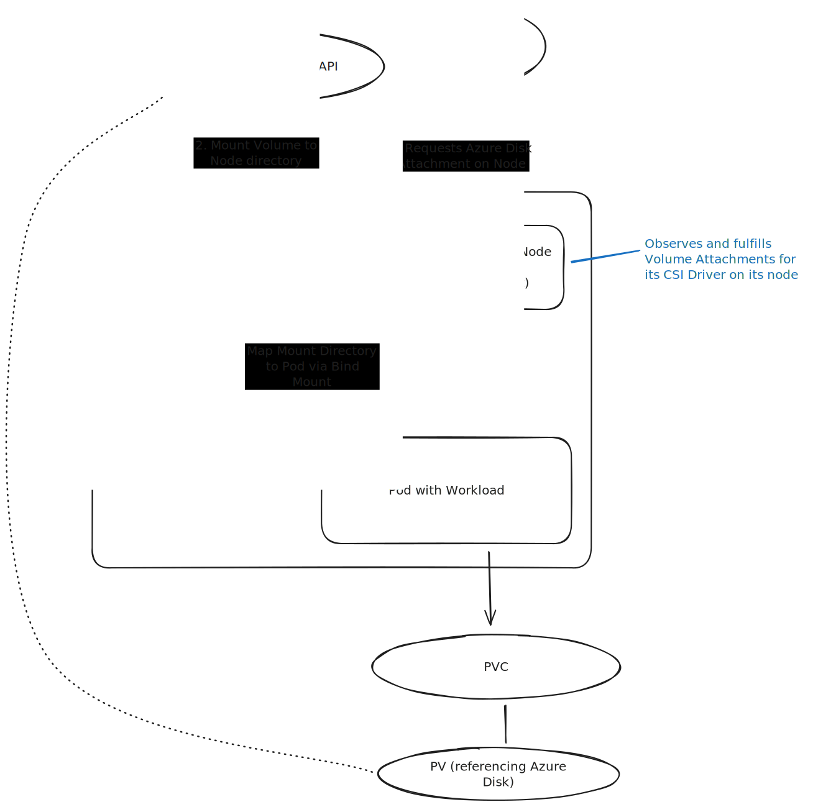
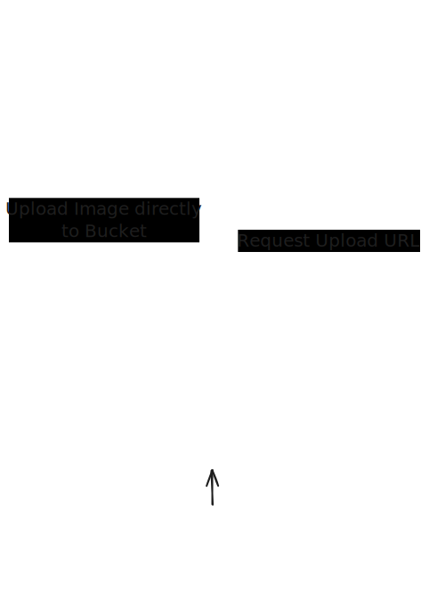
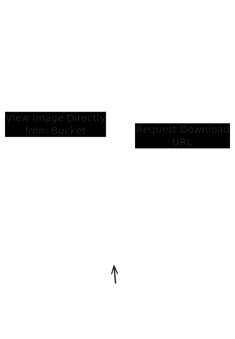
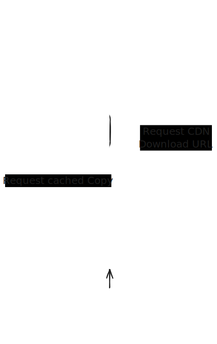
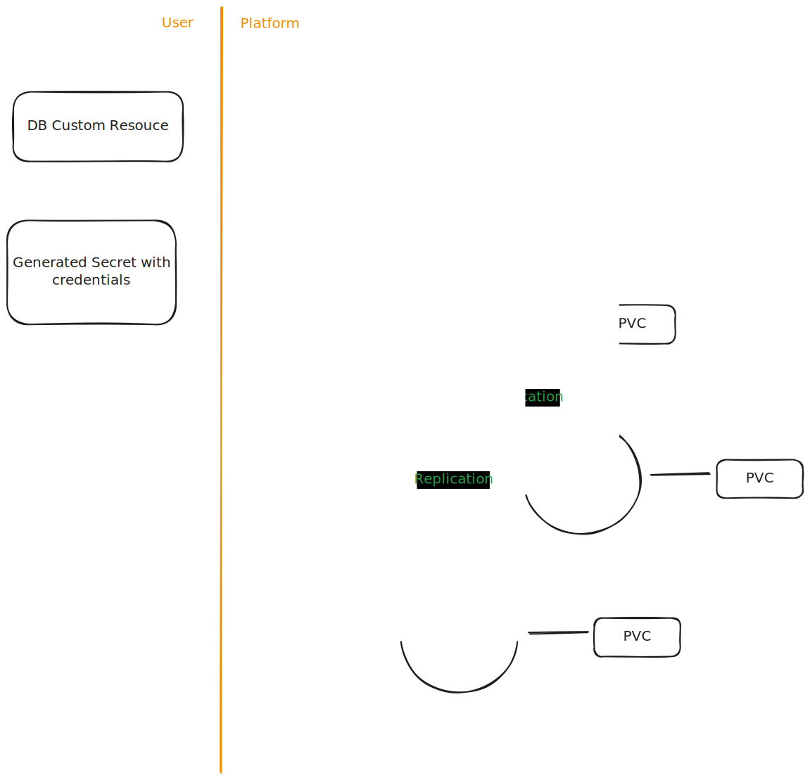

# The Storage Crashcourse

Benjamin Ritter

---

- Platform Engineering Consultant @ Scandio 
- Working mostly with Cloud Native Technologies

l0wl3vel

---

<!-- .slide: data-auto-animate -->
# *

---

<!-- .slide: data-auto-animate -->
# *

You will see the asterisk a lot

I will generalize and simplify some concepts. Things will be technically wrong, but still useful to understand the rough concept

---

## K8s Storage Resource Model

---

Kubernetes does not contain a baked in solution for storage, only interfaces to integrate with external storage providers

 

instead it allows you to bring your own via the *Container Storage Interface*

---

##### Persistent Volume Claim
- Namespaced
- Contains a volume "request"
- Attached to pod
- The resource you will be working with most

##### Persistent Volume
- Reference to the real volume on the storage platform
- Contains implementation details for the used storage driver

##### Storage Class (SC):  
- Settings for dynamically provisioning a PV from a PVC 

---

#### Dynamic Provisioning
 

---

#### Static Provisioning

---

#### Attachment semantics

- ReadWriteOnce / RWO - Attached only at one Node at a time
- ReadWriteMany / RWX - Attached to multiple Nodes at a time

- ReadOnlyMany / ROX - Attached to multiple Nodes at a time (ReadOnly)
- ReadWriteOncePod / RWOP - Attached only at one **Pod** at a time

---

#### Types of storage providers

- Cloud Provider Integrations
    - AWS EBS+EFS, Azure Files
- Connection to external storage solutions
    - Pure Storage, SMB, VSphere, JuiceFS
- Storage Operators
    - Rook Ceph, Longhorn
- Special use case
    - Local Path, Secrets CSI Driver

List of known ones: [https://kubernetes-csi.github.io/docs/drivers.html](https://kubernetes-csi.github.io/docs/drivers.html)

---

# What is CSI?

---

#### CSI Drivers?

- Maps storage solution to Kubernetes
- Handles volume lifecycle
    - Provisioning, Attachment, Mounting, Deleting
- Maintained by storage solution provider*
- Run as Pods in Kubernetes*
- Installed via Helm Charts/K8s manifests or comes with your cluster

---

#### Very short history of Kubernetes Storage

- In the beginning: in-tree Storage Providers
- Since 1.2: FlexVolume for out-of-tree providers
- Since 1.9: Container Storage Interface introduced
- 1.13: CSI is GA
- Since around 1.21: in-tree Storage Providers deprecation
- Since 1.23: FlexVolume deprecated

-> CSI **is** K8s Storage today*

---

#### Optional Features

- Online Volume Expansion
- Volume Cloning/Snapshotting
- Raw Block Volumes

---

#### How CSI mounting works?

---

### Example: Attaching an Azure Disk Volume

---

# How to select the right provider for you?

---

Everybody gangsta until the storage cluster stops clustering

-They

---

- the easiest problems are the ones you do not solve yourself
- Explore available options
- Use a cloud provider integration, if you can
- Most SANs have a CSI Provider (PureStorage, NetApp, etc.)
- Use well established solution with a high degree of automation, like Rook Ceph if you have to do it yourself

---

# Backups

---

Snapshots are not Backups

Replicas are not Backups

One Backup is no Backup

Untested Backups do not exist

If you can delete it using the credentials used to create it, it does not exist

---

#### A good backup is

- Immutable
- Tested
- Replicated
- Infrastructure independent

---

=> Object Storage

---

#### How to setup?

- Create Bucket outside of regular infrastructure permission system
- Create Credentials without delete permissions, only hiding for deployment into infrastructure
- Use a Lifecycle Rule to delete backups after they have been hidden for a while (90 days - x Years)

---

#### Velero

- Backups K8s resources as well
    - Please use GitOps for that
- Difficult to integrate with anything else than plain PVCs*
- Can do a CSI Snapshot and extract data to an object store
- Does its operations using a `DaemonSet`

---

#### K8up

- Back up all PVCs into an Object Store using Restic
- Manages helper pods for Application Level Backups
- No cluster level configuration necessary
- Does backups using `Jobs` -> only allocating resources during operations
- One `Backup` Custom Resource per namespace

---

<pre class="r-stretch"><code>apiVersion: k8up.io/v1
kind: Schedule
metadata:
  name: confluence
spec:
  backup:
    schedule: "@daily-random"
    podSecurityContext:
      runAsUser: 0
  check:
    schedule: "@weekly-random"
  prune:
    schedule: "@weekly-random"
    retention:
      keepDaily: 30
      keepMonthly: 6
      keepWeekly: 8
  backend:
    s3:
      endpoint: https://s3.eu-central-003.backblazeb2.com
      bucket: "backupbucket/apps-confluence"
      accessKeyIDSecretRef:
        name: k8up-credentials
        key: username
      secretAccessKeySecretRef:
        key: password
        name: k8up-credentials
    repoPasswordSecretRef:
      key: restic_password
      name: k8up-credentials
</code></pre>

---

<pre class="r-stretch"><code>apiVersion: k8up.io/v1
kind: PreBackupPod
metadata:
  name: confluence-db-backup
spec:
  backupCommand: pg_dump
  fileExtension: .sql
  pod:
    spec:
      containers:
      - name: confluence-db-dump
        image: postgres:latest
        env:
          - name: PGDATABASE
            value: confluence
          - name: PGHOST
            value: acid-confluence
          - name: PGPASSWORD
            valueFrom:
              secretKeyRef:
                key: password
                name: confluence.acid-confluence.credentials.postgresql.acid.zalan.do
          - name: PGUSER
            valueFrom:
              secretKeyRef:
                key: username
                name: confluence.acid-confluence.credentials.postgresql.acid.zalan.do
        command:
          - 'sleep'
          - 'infinity'
</code></pre>

---

# Alternatives to PVCs

---

#### S3 Style Object Stores

- Read-After-Write consistent*
- High Time-To-First-Byte Latency (100ms+)*
- Partial Downloads
- Per-Request Performance limit instead of Per-Bucket limit
- Big Limitation: NO PARTIAL OBJECT UPDATES
- Cheaper than block storage*

---

#### Presigned URLs in S3

Delegate temporary S3 Permissions directly to the end-user client

Allows you to move data without passing through your own application/infrastructure

---

#### Upload

---

#### Download

---

#### Using a CDN

---

# Running Databases in-cluster

---

<!-- .slide: data-auto-animate -->
#### Why?

---

<!-- .slide: data-auto-animate -->
#### Why?

Managed Databases are fine, but

- Poor integration with Kubernetes CD
- Expensive
- Different features across cloud vendors
- Latency
- Separate Database Teams add communication overhead

---

#### General advice (regardless of DB)

- Run a DB cluster, please
- Use an operator if you need persistence
- Test your application to handle DB reconnection
- Use monitoring and backups

---

# ACID Databases

Postgres, MySQL, MariaDB

---

#### ACID Databases Considerations

- Use a fast, low latency PVC
- Run your DB in the same K8s cluster as the application

---

---

#### CloudNative PG

CNCF Project

Does all the things

WAL Streaming, Automatic Backups, Replication, Upgrades, Point-In-Time Restore

[https://cloudnative-pg.io/](https://cloudnative-pg.io/)

---

#### Zalando Postgres Operator

A bit older, based on a project called Patroni for Docker

Similar to CNPG, but some features hard to use outside of AWS (e.g. WAL Streaming)

Use the more modern CNPG

[https://github.com/zalando/postgres-operator](https://github.com/zalando/postgres-operator)

---

#### MySQL Operator

Built by Oracle

Tried to use it, but had issues all around in the beginning of 2023

Might be better now

¯\\\_(ツ)\_/¯

---

#### Vitess

- MySQL Compatible
- Kubernetes Native design
- Supports data sharding
- Some compatibility limitations: [https://vitess.io/docs/19.0/reference/compatibility/mysql-compatibility/](https://vitess.io/docs/19.0/reference/compatibility/mysql-compatibility/)

---

#### OracleDB Operator

[https://github.com/oracle/oracle-database-operator](https://github.com/oracle/oracle-database-operator)

---

#### Backups

- WAL Archiving
- Regular Dumps, if size allows for it

---

# Fun times with network attached storage

---

#### Running Storage Clusters inside Kubernetes

Long: Failover on the protocol level is a must

Short: Yes, if it is Rook Ceph

---

#### Latency

- Using networked filesystems introduces significant IO latency >0.5ms
- Limits your sequential throughput to 2000 ops/s
- Leads to high commit/flush latency

Solution:

Agressively parallelize your IO - Your throughput will scale pretty well*

---

# Thank you

